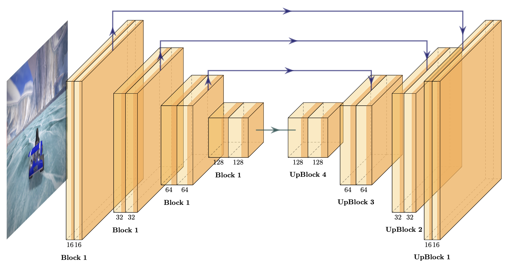

# Playing PyTuxKart Ice-Hockey Game with Image-Based Agent

## Introduction

The task for this final project is to program a Su- perTuxKart ice-hockey player with the choice of either image-based agent or state–based agent. The objective of this hockey game is to score as many goals as possible in this 2 vs 2 tournament against the TA agents. Our team decided to build an image-based agent that takes the image as input and predicts the location of the puck and goal with two slightly different methods: The Pointer Method and The Heatmap Method. The reason we chose to use an image-based agent because we have been learn- ing and processing the image with the model throughout the class.

## Image-Based Agent

The primary task for an image-based agent is to design a model that takes a player image as input and infer (1) whether targets (the puck and goals) are in the image
(2) the location of the puck and goals. We proposed two methods that output the above information:

### Method 1

The agent takes an input image and output two 2d pointer vectors of the puck and the (opponent’s) goal location. See Fig. 2 for the schematic plot. With the 2d pointer vectors, the controller and calculate the distance and the angles to the puck and the goal and drives the kart to these two positions.

### Method 2

Similar to the tasks and model of the HW4 of the course, the agent performs a object-detection task by learning the heatmap of the input image and infer the object locations and size.

## Model Architecture 

